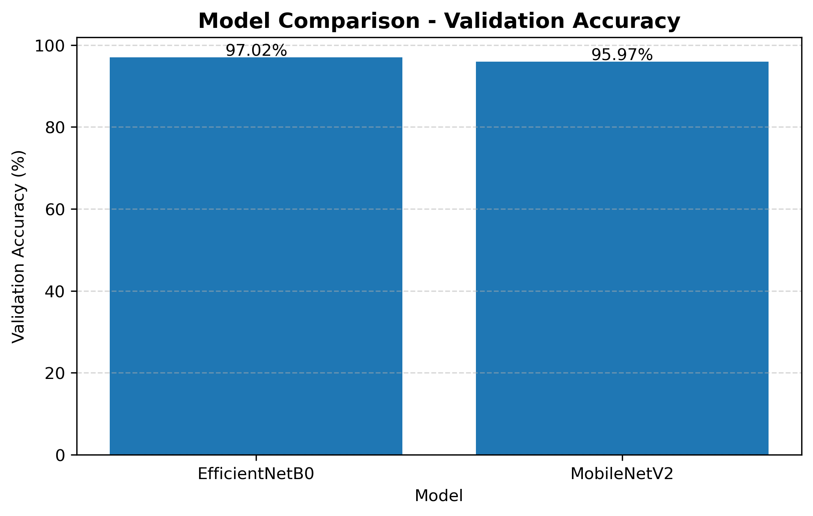
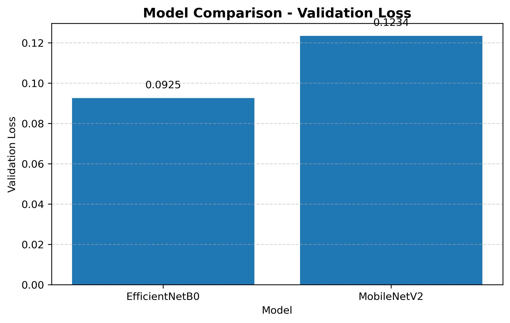
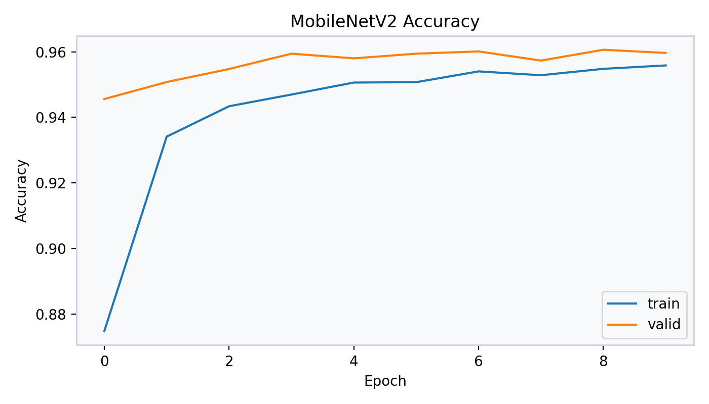
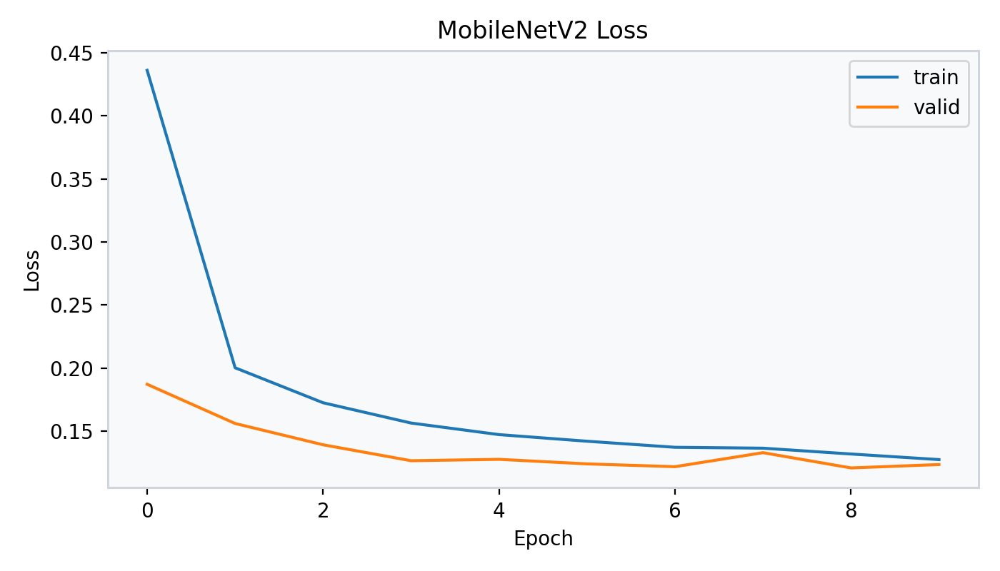
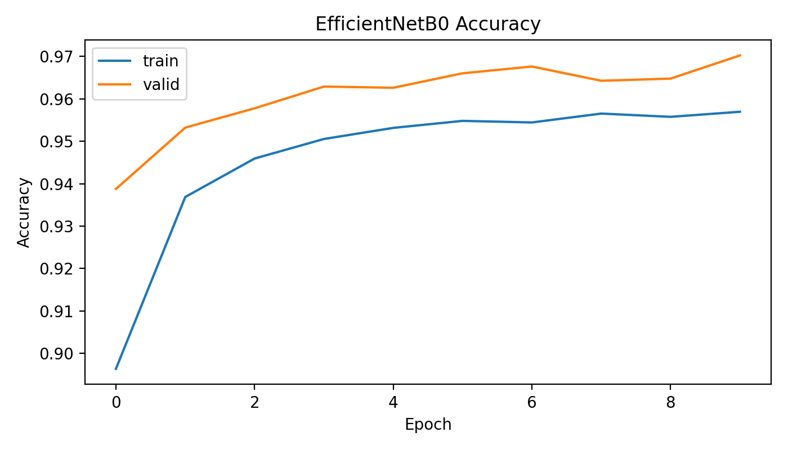
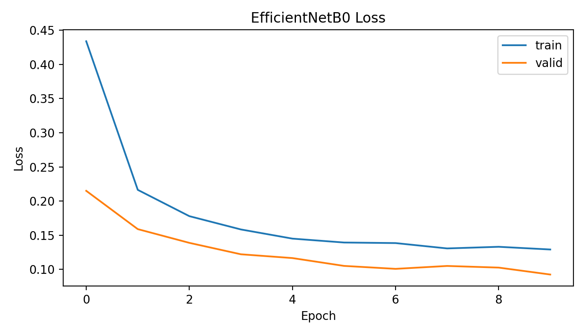
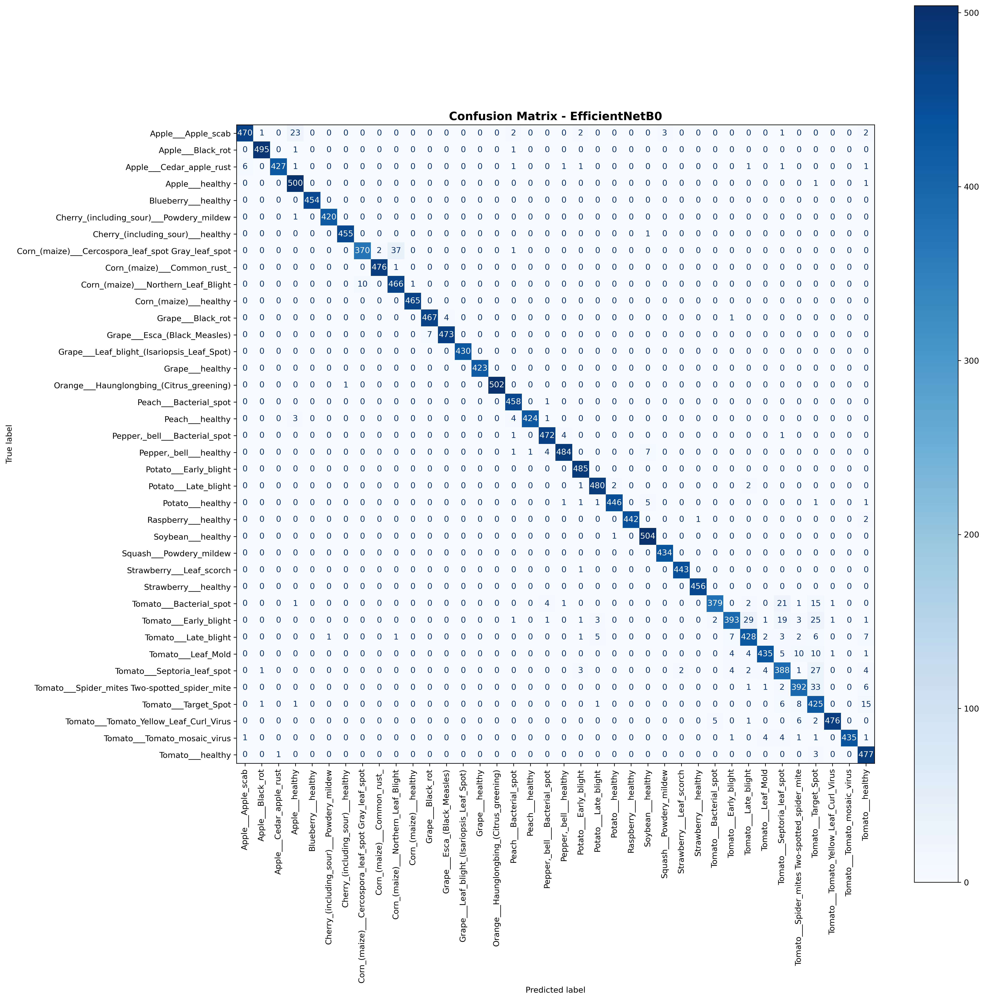
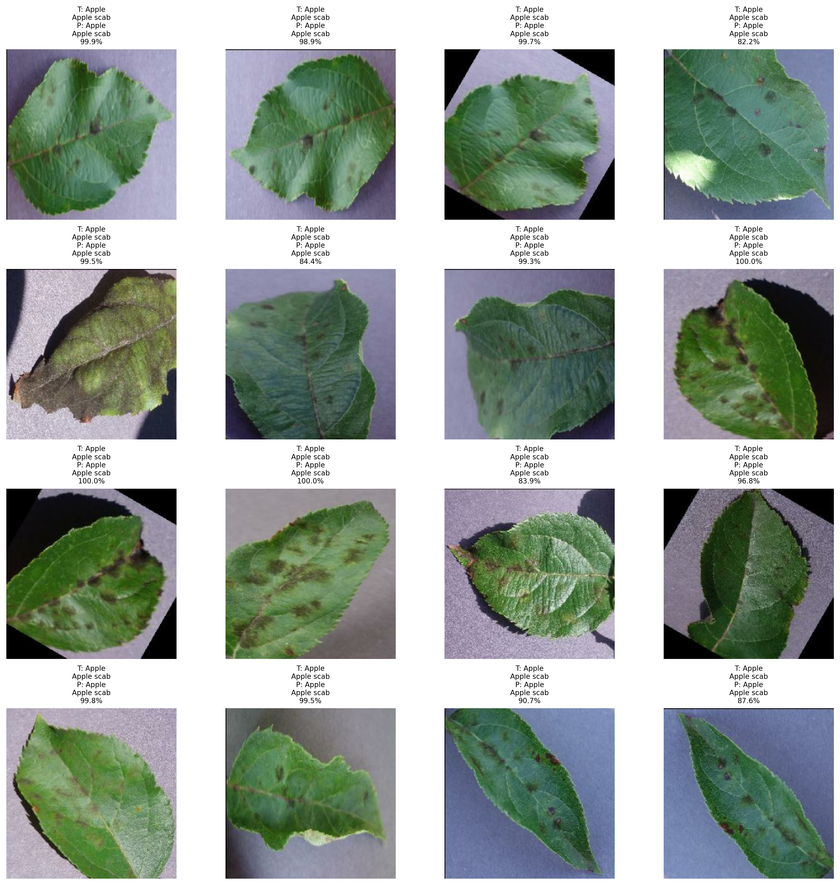
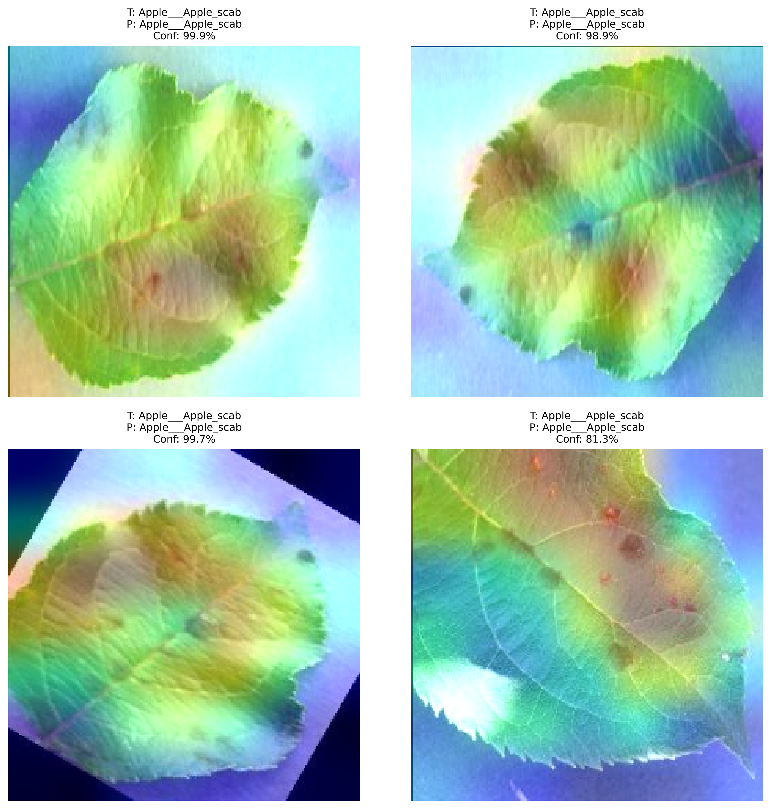

<h1 align="center">Crop Disease Classification with Transfer Learning and Grad-CAM</h1>

<p align="center">
  Deep learning computer vision system for crop leaf disease recognition using transfer learning, CNN model comparison, validation-based evaluation, and Grad-CAM visualization.
</p>
<p align="center">
  
  
  
  
</p>

---

## Overview

This project builds an image classification pipeline for detecting crop leaf disease categories from visible leaf symptoms.

The workflow includes:

- Dataset preparation from a PlantVillage crop disease dataset
- Transfer learning with pretrained CNN architectures
- MobileNetV2 lightweight baseline
- EfficientNetB0 high-performance comparison model
- Validation-based model evaluation
- Classification report and confusion matrix analysis
- Sample prediction visualization
- Grad-CAM visualization
- Config-based evaluation and prediction scripts
- Streamlit deployment interface

The final selected model is **EfficientNetB0**, based on validation performance.

---

## Technical Focus

- Transfer learning for image classification
- CNN architecture comparison
- Validation-based model selection
- Deep learning evaluation workflow
- Grad-CAM visualization
- Single-image inference pipeline
- Lightweight deployment with Streamlit

---

## Classification Target

Input:

```text
crop leaf image
```
Output:

```text
crop-disease class
```

Example labels:

```text
Apple___Apple_scab → Apple / Apple scab
Tomato___Late_blight → Tomato / Late blight
Tomato___healthy → Tomato / healthy
```


This project focuses on supervised image classification, where the model receives a crop leaf image and predicts a combined crop-disease class.

Example class label:

```text
Apple___Apple_scab
```

Meaning:

```text
Crop: Apple
Condition: Apple scab
```

Another example:

```text
Tomato___Late_blight
```

Meaning:

```text
Crop: Tomato
Condition: Late blight
```

---

## Dataset

The dataset used in this project is the **New Plant Diseases Dataset** from Kaggle.

```text
Dataset: New Plant Diseases Dataset
Author: vipoooool
Format: PlantVillage image classification dataset
```

Expected local dataset path:

```text
data/new_plant_diseases_dataset/
```

Expected folder structure:

```text
data/new_plant_diseases_dataset/
├── train/
├── valid/
└── test/
```

The dataset contains crop leaf images organized by class folders. Each class represents a crop and its disease condition.

Example classes:

```text
Apple___Apple_scab
Apple___Black_rot
Corn_(maize)___Common_rust
Potato___Early_blight
Tomato___Late_blight
Tomato___healthy
```

---

## Dataset Note

The dataset is stored locally and is not uploaded to GitHub.

The provided `test/` folder in this dataset version is a small flat sample folder, not a complete labeled 38-class test split. Because of this, final model comparison and evaluation are performed using the labeled `valid/` split.

---

## Model Architecture

Two pretrained CNN architectures are evaluated for transfer learning:

```text
1. MobileNetV2
2. EfficientNetB0
```

Both models are trained for 38 crop disease classes.

---

## MobileNetV2

MobileNetV2 is used as the lightweight baseline model.

Model file:

```text
models/crop_disease_mobilenetv2_1.keras
```

MobileNetV2 requires its own preprocessing function:

```python
mobilenet_v2.preprocess_input
```

This preprocessing step is required during both training and evaluation.

---

## EfficientNetB0

EfficientNetB0 is used as the stronger comparison model.

Model file:

```text
models/crop_disease_efficientnetb0_2.keras
```

Best model copy:

```text
models/best_model.keras
```

In this project setup, EfficientNetB0 uses raw image tensors loaded from `image_dataset_from_directory` without applying MobileNetV2 preprocessing.

EfficientNetB0 achieved the strongest validation performance and is used as the final selected model.

---

## Preprocessing Note

Different pretrained models require different preprocessing.

MobileNetV2 evaluation uses:

```python
mobilenet_valid_ds = raw_valid_ds.map(
    lambda images, labels: (
        mobilenet_v2.preprocess_input(tf.cast(images, tf.float32)),
        labels
    )
).prefetch(tf.data.AUTOTUNE)
```

EfficientNetB0 evaluation uses:

```python
efficientnet_valid_ds = raw_valid_ds.prefetch(tf.data.AUTOTUNE)
```

MobileNetV2 preprocessing should not be applied to EfficientNetB0 in this project setup.

---

## Results

| Model | Validation Accuracy | Validation Loss |
|---|---:|---:|
| MobileNetV2 | ~95–96% | ~0.12 |
| EfficientNetB0 | ~97% | ~0.09 |

EfficientNetB0 achieved the best validation performance and is selected as the final model.

---

## Model Comparison

The two models are compared on the same labeled validation split.





---

## Training Curves

Training curves are generated from the training history of each model.

### MobileNetV2





### EfficientNetB0





---

## Evaluation

The final model is evaluated using:

- Validation accuracy
- Validation loss
- Classification report
- Confusion matrix
- Sample prediction visualization

### Confusion Matrix



### Sample Predictions



---

## Grad-CAM Visualization

Grad-CAM is used to highlight image regions that influenced the model prediction.

This helps inspect whether the model is focusing on leaf regions instead of irrelevant background areas.

Grad-CAM does not prove that a prediction is correct. It provides visual support for understanding model attention.



---

## Notebook Workflow

The main deep learning workflow is organized into notebooks.

Run order:

```text
1. notebooks/01_mobilenetv2.ipynb
2. notebooks/02_efficientnetb0.ipynb
3. notebooks/03_compare_models.ipynb
```

The notebooks cover:

```text
Setup
Load Dataset
Build Model
Optional Training
Evaluate
Visuals
Save Results
```

The notebook workflow separates training, evaluation, and comparison into reproducible stages.

---

## Evaluation and Inference Pipeline

The project includes a lightweight structure for repeatable evaluation, prediction, and app usage.

```text
configs/
├── mobilenetv2_config.json
└── efficientnetb0_config.json

src/
├── utils.py
├── predict.py
└── evaluate.py

app/
└── streamlit_app.py
```

The configuration files store model and dataset settings such as:

```text
model name
model path
dataset path
image size
batch size
class names path
preprocessing requirement
```

---

## Evaluation Script

Run evaluation from the project root:

```bash
python src/evaluate.py --config configs/efficientnetb0_config.json
```

This evaluates the selected model on the validation split and exports evaluation metrics.

---

## Prediction Script

Run single-image prediction:

```bash
python src/predict.py --image path/to/leaf.jpg --model models/best_model.keras --class-names results/class_names.json
```

Prediction output includes:

```text
crop
condition
confidence
top 3 predictions
```

---
## Streamlit Demo

The project includes a deployed Streamlit interface for image upload and prediction.

Live demo:

```text
https://crop-disease-detection-deep-learning-zz.streamlit.app/
```

Run locally:

```bash
streamlit run app/streamlit_app.py
```

The interface displays:

```text
uploaded image
predicted crop
predicted condition
confidence score
confidence level
top 3 predictions
```

The app uses the final selected model:

```text
models/best_model.keras
```

Since the selected model is EfficientNetB0, the Streamlit app does not apply MobileNetV2 preprocessing.

Limitation note shown in the app:

```text
This model predicts crop disease class from visible leaf symptoms.
```
## Outputs

Saved outputs are stored under `results/` and `results/figures/`.

Key output files:

```text
results/class_names.json
results/model_comparison.json
results/model_comparison_table.csv
results/model_registry.json
results/best_model_metrics.json
results/efficientnetb0_classification_report.csv
results/efficientnetb0_metrics.json
results/mobilenetv2_metrics.json
results/evaluation_metrics.json
```

Figure outputs:

```text
results/figures/model_comparison_accuracy.png
results/figures/model_comparison_loss.png
results/figures/mobilenetv2_accuracy_curve.png
results/figures/mobilenetv2_loss_curve.png
results/figures/efficientnetb0_accuracy_curve.png
results/figures/efficientnetb0_loss_curve.png
results/figures/efficientnetb0_confusion_matrix.png
results/figures/efficientnetb0_sample_predictions.png
results/figures/efficientnetb0_gradcam_examples.png
```

---

## Repository Structure

```text
crop-disease-detection-deep-learning/
├── notebooks/
│   ├── 01_mobilenetv2.ipynb
│   ├── 02_efficientnetb0.ipynb
│   └── 03_compare_models.ipynb
│
├── configs/
│   ├── mobilenetv2_config.json
│   └── efficientnetb0_config.json
│
├── src/
│   ├── utils.py
│   ├── predict.py
│   └── evaluate.py
│
├── app/
│   └── streamlit_app.py
│
├── models/
│   ├── README.md
│   ├── crop_disease_mobilenetv2_1.keras
│   ├── crop_disease_efficientnetb0_2.keras
│   └── best_model.keras
│
├── results/
│   ├── class_names.json
│   ├── model_comparison.json
│   ├── model_comparison_table.csv
│   ├── model_registry.json
│   ├── best_model_metrics.json
│   ├── efficientnetb0_classification_report.csv
│   ├── experiments/
│   └── figures/
│
├── data/
│   ├── README.md
│   └── new_plant_diseases_dataset/
│
├── requirements.txt
├── README.md
└── .gitignore
```

---

## Configuration

Model and dataset settings are stored in `configs/`.

Main configuration files:

```text
configs/mobilenetv2_config.json
configs/efficientnetb0_config.json
```

The saved class order is stored in:

```text
results/class_names.json
```

This keeps prediction and evaluation consistent with the trained model.

---

## Limitations

- The model is trained on a PlantVillage-style dataset with mostly clean leaf images.
- Performance may decrease on real farm images with blur, shadows, multiple leaves, occlusion, or complex backgrounds.
- Predictions are based only on visible leaf symptoms in the input image.
- The output should not be treated as a final agricultural diagnosis.
- The provided `test/` folder is not used for final evaluation because it is not a complete labeled 38-class split.
- Grad-CAM is used for visualization, not as proof of prediction correctness.

---
